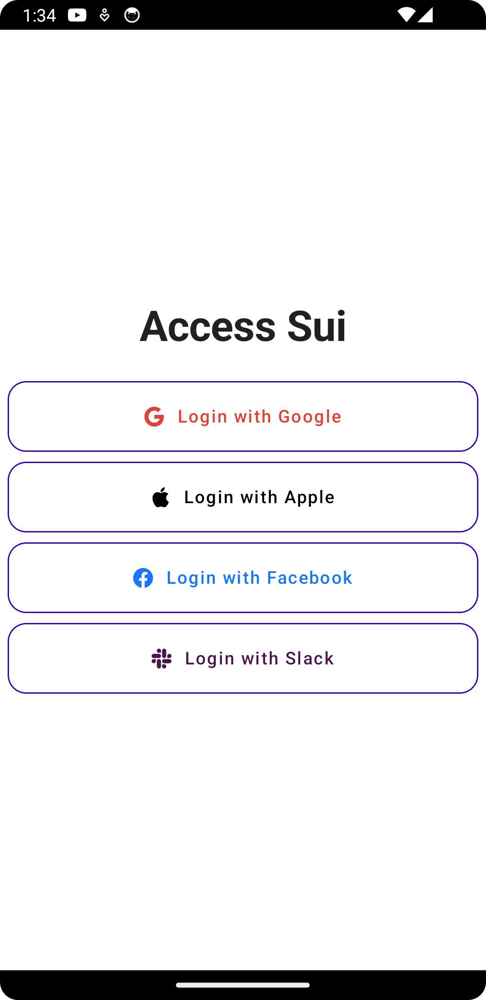

# Kotlin Multiplatform

This is a simple example of a KMP project utilizing `ZeroAuth` for zkLogin. It consists of a common lib `shared` between 
the platforms and various platform-specific implementations i.e. Android, iOS, JVM, and native Desktop (Linux, macOS, Win)
found in the respective modules.

## Shared Module

The shared module contains the common code that is shared between the platforms. 

## Android Module



The `androidApp` module contains the Android specific code.

### Configuration

In order to run the Android app, as with all other clients, you need a valid client ID that can be obtained from the 
OpenID Connect providers. Replace the `zeroAuthRedirectScheme` manifest 
placeholder in `build.gradle` (for the app module) with the client ID you got from the OpenID Connect provider.

You will also need the SHA-1 fingerprint of the certificate used to sign the app. After building the app 
(`./gradlew assembleDebug`), the **zero.keystore** file contains the certificate used and the signature can be displayed 
by running:
```shell
    keytool -list -v -keystore zero.keystore
 ```


<details>
<summary>Google</summary>
The format for the client ID for Google is `PREFIX.apps.googleusercontent.com`, where PREFIX is an alphanumeric string 
unique to your client ID.

**Note**: 
1. You will need to add the SHA-1 fingerprint of the certificate used to sign the app to the list of fingerprints.
2. You will also need to enable custom URL schemes for the app in the Google Cloud Console. (don't forget to register
your app in case your releasing to production)
</details>


### Running the Android app

Once you are done with the configuration, you can run the Android app by running the following command in the terminal:

```shell
./gradlew androidApp:installDebug
```